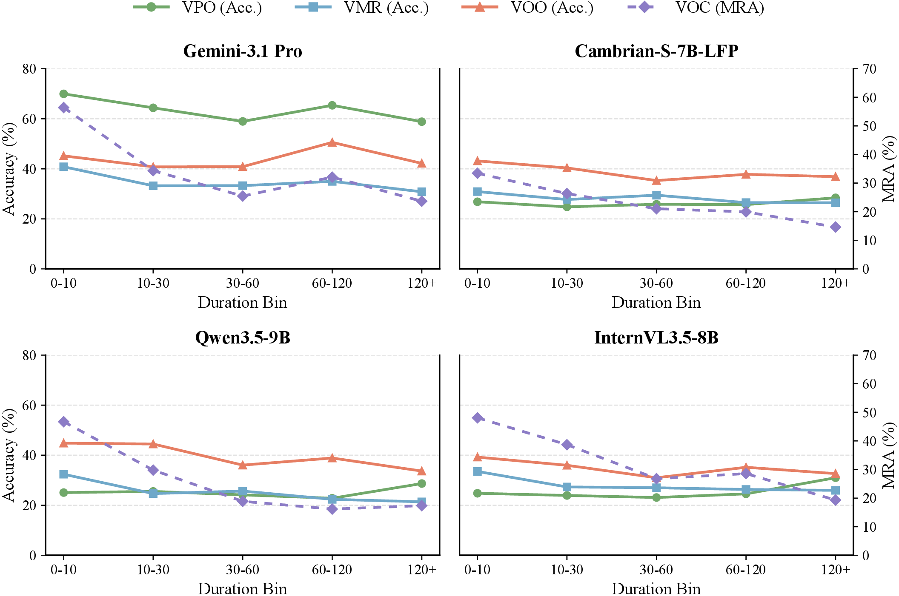

# VSI-Super-Wild

**Towards Spatial Supersensing in the Wild**  
**ECCV 2026**

[](https://vsi-super-wild.github.io/)
[](https://arxiv.org/)
[](https://github.com/THUSI-Lab/VSI-Super-Wild)
[](https://huggingface.co/datasets/THUSI-Lab/VSI-Super-Wild)

VSI-Super-Wild is an ECCV 2026 benchmark for evaluating whether multimodal large language models can build, maintain, and query implicit world states from genuinely long-form, in-the-wild video streams. It advances spatial supersensing beyond synthetic indoor clips and object-centric probing toward real-world egocentric experience across the **agent-object-environment** triad.


## Highlights

- **In-the-Wild Video Benchmark:** VSI-Super-Wild curates 442 long-form videos across 8 scene categories, totaling 284.52 hours, with 6,980 human-verified QA pairs for spatial supersensing in unconstrained, real-world settings.
- **Multi-Anchor Task Suite:** four cognitively grounded tasks probe implicit world states beyond objects, spanning agent, object, and environment anchors to systematically evaluate world modeling over space and time.
- **Diagnostic Insights:** benchmarking mainstream MLLMs with task- and horizon-wise analyses exposes recurring failure modes and open challenges for spatial supersensing in the wild.

## Motivation

Existing spatial supersensing benchmarks mark an important step toward testing implicit world modeling, but they leave real-world continuity and broader world-state coverage underexplored. VSI-Super-Wild moves from concatenated short indoor clips toward natural long-video streams and multi-anchor probing of agent, object, and environment states.


## Task Suite

VSI-Super-Wild evaluates four tasks over the agent-object-environment triad:

| Task | Name | Anchor | What It Tests |
|---|---|---|---|
| `VMR` | Motion Orientation Recall | Agent | Inferring camera/person motion orientation relative to viewing direction at a queried moment. |
| `VPO` | Place Temporal Ordering | Environment | Ordering place frames under yaw-rotated viewpoints, requiring heading-invariant place representations. |
| `VOO` | Object Temporal Ordering | Object | Ordering queried objects by first or last occurrence, testing object-state updates over time. |
| `VOC` | Continuous Object Counting | Object | Predicting unique-instance counts from a full video stream with a maintained count state. |


## Dataset Construction

The benchmark is built through a semi-automatic pipeline with human-in-the-loop verification. We collect and filter in-the-wild panoramic YouTube videos, project panoramas into perspective views, derive temporal and spatial metadata, synthesize rule-based QA, and verify the resulting samples with rollback when metadata or QA needs refinement.


## Statistics

The released QA file contains:

| Split File | QA Rows | Unique Videos |
|---|---:|---:|
| `tasks/vsi_super_wild/data/vsi_super_wild_qa.jsonl` | 6,980 | 442 |

Task distribution:

| Task | QA Rows |
|---|---:|
| `VOC` | 1,113 |
| `VMR` | 1,215 |
| `VPO` | 1,302 |
| `VOO` | 3,350 |


## Data Preparation

Download the VSI-Super-Wild video files from the [Hugging Face dataset](https://huggingface.co/datasets/THUSI-Lab/VSI-Super-Wild), then extract them into the repository-level `data/` directory:

```text
VSI-Super-Wild/
├── data/
│   ├── long_video_persp/
│   ├── new_long_video_persp/
│   └── top20merge_0207_persp/
└── tasks/vsi_super_wild/data/vsi_super_wild_qa.jsonl
```

By default, the evaluator looks for videos under `./data`. If your videos live elsewhere, set:

```bash
export VSI_SUPER_WILD_VIDEO_ROOT=/path/to/extracted/videos
```

The QA file stores clean names such as `Z7ta3z5qcMA_back.mp4`; the resolver supports both exact filenames and mirrored files with semantic prefixes.

## Evaluation Setup

Install lmms-eval first, then install the runtime dependencies for this release package:

```bash
pip install -r requirements.txt
```

If you use an existing lmms-eval checkout, keep it on `PYTHONPATH` or run from that environment. The task is included through `--include_path ./tasks`.

After extracting videos into `data/`, run a small evaluation:

```bash
python scripts/run_vsi_super_wild_eval.py \
  --model qwen2_5_vl \
  --model_args "pretrained=Qwen/Qwen2.5-VL-7B-Instruct" \
  --limit 10
```

Check command wiring without loading a model:

```bash
python scripts/run_vsi_super_wild_eval.py \
  --model qwen2_vl \
  --model_args pretrained=dummy \
  --limit 2 \
  --dry_run
```

You can also call lmms-eval directly:

```bash
python -m lmms_eval eval \
  --model qwen2_5_vl \
  --model_args "pretrained=Qwen/Qwen2.5-VL-7B-Instruct" \
  --tasks vsi_super_wild \
  --include_path ./tasks \
  --batch_size 1 \
  --device cuda \
  --log_samples
```

## Metrics

The task reports:

- `accuracy` for multiple-choice and temporal-ordering tasks.
- `mra` for continuous counting (`VOC`), computed from relative count error.

For counting, a close numeric prediction receives partial credit through MRA even when exact-match accuracy is zero.

## Repository Layout

```text
.
├── assets/
├── data/                  # extracted videos from Hugging Face
├── scripts/
│   ├── recompute_results_from_samples.py
│   └── run_vsi_super_wild_eval.py
├── tasks/
│   └── vsi_super_wild/
│       ├── vsi_super_wild.yaml
│       ├── utils.py
│       └── data/
│           └── vsi_super_wild_qa.jsonl
├── requirements.txt
├── run.sh
└── run_lmms_eval.sh
```

## Diagnostics

VSI-Super-Wild reveals recurring failure modes in current MLLMs, including spatial collapse, semantic shortcuts, insufficient updates, and instance confusion under long-horizon real-world video streams.




## Citation

```bibtex
@misc{vsi_super_wild,
  title        = {Towards Spatial Supersensing in the Wild},
  author       = {Gu, Tianjun and Xin, Tianyu and Zhang, Kuan and others},
  year         = {2026},
  howpublished = {\url{https://vsi-super-wild.github.io/}}
}
```
