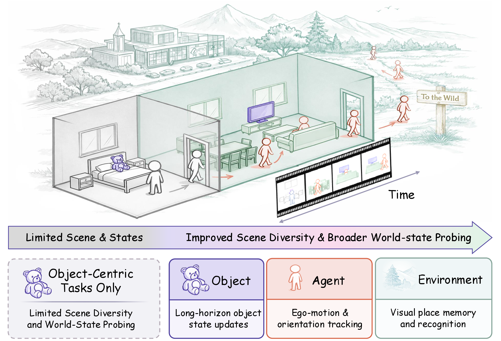
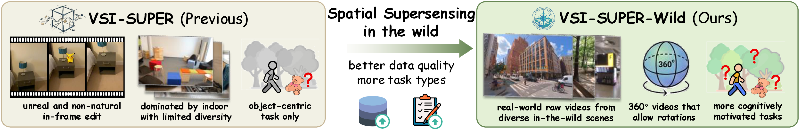
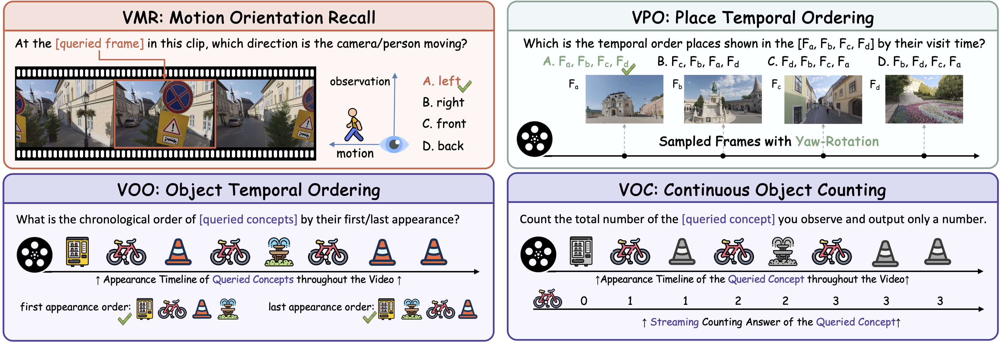
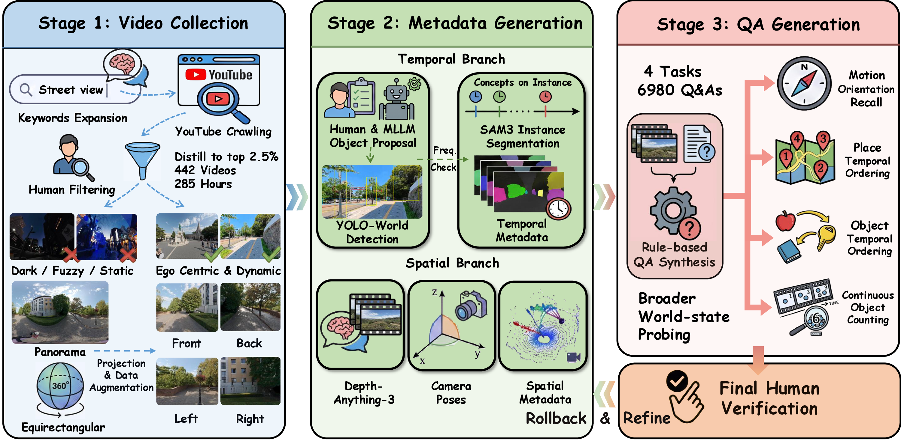
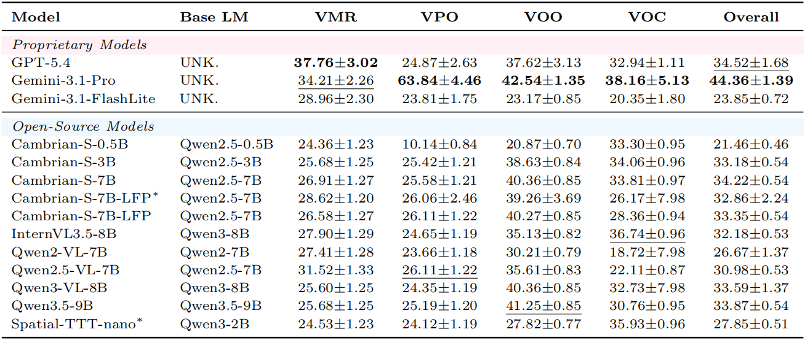
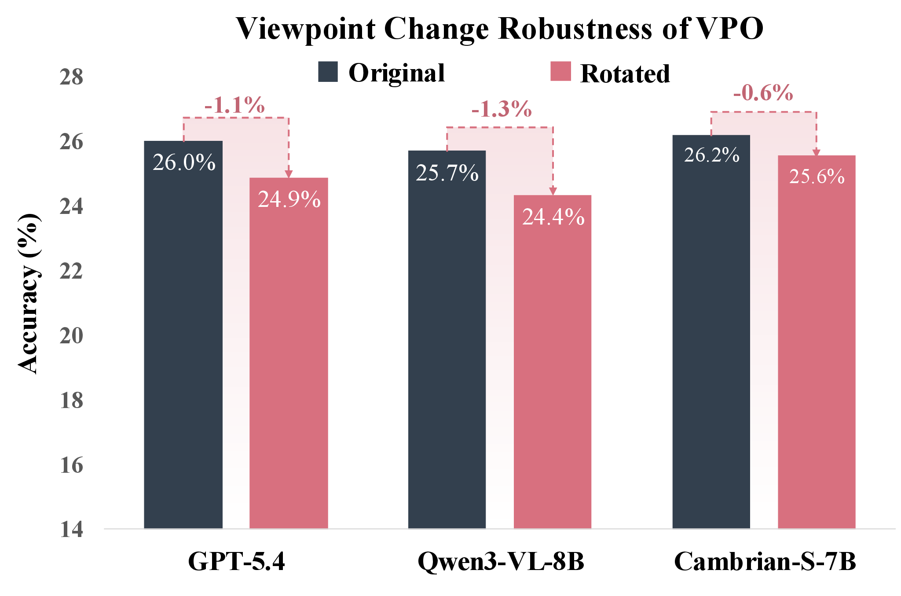
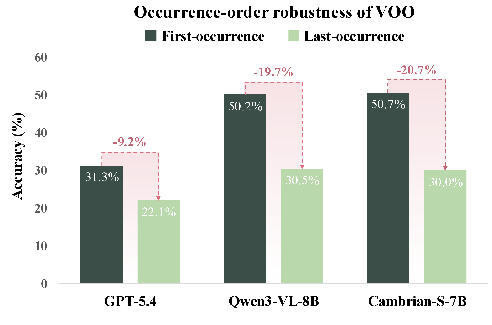

<div align="center">

# [ECCV 2026] Towards Spatial Supersensing in the Wild

</div>

[](https://vsi-super-wild.github.io/)
[](https://arxiv.org/pdf/2607.13681)
[](https://github.com/THUSI-Lab/VSI-Super-Wild)
[](https://huggingface.co/datasets/THUSI-Lab/VSI-Super-Wild)

Humans make sense of continuous sensory streams by maintaining implicit world states that support spatial reasoning and prediction. Spatial supersensing asks whether multimodal models can develop similar capabilities, but existing benchmarks remain largely synthetic, household-centered, and object-centric. **VSI-Super-Wild** addresses this gap with real-world, in-the-wild videos spanning diverse temporal horizons and cognitively grounded tasks that probe world modeling across the **agent-object-environment** triad.



## Highlights

- **In-the-Wild Video Benchmark:** In total, **VSI-Super-Wild** contains **442** real-world videos across 8 scene categories, with the longest recordings exceeding 4 hours, and **6,980** human-verified question-answer pairs.
- **Multi-Anchor Task Suite:** four cognitively grounded tasks probe implicit world states beyond objects, spanning agent, object, and environment anchors to systematically evaluate world modeling over space and time.
- **Diagnostic Insights:** benchmarking mainstream MLLMs with task- and horizon-wise analyses exposes recurring failure modes and open challenges for spatial supersensing in the wild.

## Motivation

Existing spatial supersensing benchmarks mark an important step toward testing implicit world modeling, but they leave real-world continuity and broader world-state coverage underexplored. VSI-Super-Wild moves from concatenated short indoor clips toward natural real-world video streams, including recordings exceeding 4 hours, and multi-anchor probing of agent, object, and environment states.



## Task Suite

VSI-Super-Wild evaluates four tasks over the agent-object-environment triad:

| Task | Name | Anchor | What It Tests |
|---|---|---|---|
| `VMR` | Motion Orientation Recall | Agent | Inferring camera/person motion orientation relative to viewing direction at a queried moment. |
| `VPO` | Place Temporal Ordering | Environment | Ordering place frames under yaw-rotated viewpoints, requiring heading-invariant place representations. |
| `VOO` | Object Temporal Ordering | Object | Ordering queried objects by first or last occurrence, testing object-state updates over time. |
| `VOC` | Continuous Object Counting | Object | Predicting unique-instance counts from a full video stream with a maintained count state. |



## Dataset Construction

The benchmark is built through a semi-automatic pipeline with human-in-the-loop verification. We collect and filter in-the-wild panoramic YouTube videos, project panoramas into perspective views, derive temporal and spatial metadata, synthesize rule-based QA, and verify the resulting samples with rollback when metadata or QA needs refinement.



## Statistics

The released QA file contains:

| Split File | QA Rows | Unique Videos |
|---|---:|---:|
| `tasks/vsi_super_wild/data/vsi_super_wild_qa.jsonl` | 6,980 | 442 |

Task distribution:

| Task | QA Rows |
|---|---:|
| `VOC` | 1,113 |
| `VMR` | 1,215 |
| `VPO` | 1,302 |
| `VOO` | 3,350 |


## Data Preparation

Download the VSI-Super-Wild video files from the [Hugging Face dataset](https://huggingface.co/datasets/THUSI-Lab/VSI-Super-Wild), then extract or place all videos directly under the repository-level `data/` directory:

```text
VSI-Super-Wild/
├── data/
│   ├── Z7ta3z5qcMA_back.mp4
│   ├── ...
│   └── <video_name>.mp4
└── tasks/vsi_super_wild/data/vsi_super_wild_qa.jsonl
```

By default, the evaluator looks for videos under `./data`. If your videos live elsewhere, set:

```bash
export VSI_SUPER_WILD_VIDEO_ROOT=/path/to/extracted/videos
```

The QA file stores only clean filenames in `video_name`, such as `Z7ta3z5qcMA_back.mp4`; no subfolder field is required. The evaluator resolves each sample as `VSI_SUPER_WILD_VIDEO_ROOT/video_name`, with fallback support for older mirrored filenames with semantic prefixes.

## Evaluation Setup

Install the tested lmms-eval revision and runtime dependencies for this release package:

```bash
pip install -r requirements.txt
```

If you use an existing lmms-eval checkout, keep it on `PYTHONPATH` or run from that environment. The task is included through `--include_path ./tasks`.

After extracting videos into `data/`, run a small evaluation:

```bash
python scripts/run_vsi_super_wild_eval.py \
  --model qwen2_5_vl \
  --model_args "pretrained=Qwen/Qwen2.5-VL-7B-Instruct" \
  --limit 10
```

Check command wiring without loading a model:

```bash
python scripts/run_vsi_super_wild_eval.py \
  --model qwen2_vl \
  --model_args pretrained=dummy \
  --limit 2 \
  --dry_run
```

You can also call lmms-eval directly:

```bash
python -m lmms_eval eval \
  --model qwen2_5_vl \
  --model_args "pretrained=Qwen/Qwen2.5-VL-7B-Instruct" \
  --tasks vsi_super_wild \
  --include_path ./tasks \
  --batch_size 1 \
  --device cuda \
  --log_samples
```

## Metrics

The task reports the same five scores as the paper:

- `vmr_accuracy`, `vpo_accuracy`, and `voo_accuracy` for the three multiple-choice tasks.
- `voc_mra` for continuous counting (`VOC`), computed from relative count error.
- `overall`, the question-level aggregate score across all tasks.

For counting, a close numeric prediction receives partial credit through MRA. VOC does not report an additional accuracy score.

## Performance Overview

<p align="center">
  
</p>

## Repository Layout

```text
.
├── assets/
├── data/                  # extracted videos from Hugging Face
├── scripts/
│   ├── recompute_results_from_samples.py
│   └── run_vsi_super_wild_eval.py
├── tests/
│   └── test_vsi_super_wild.py
├── tasks/
│   └── vsi_super_wild/
│       ├── vsi_super_wild.yaml
│       ├── utils.py
│       └── data/
│           └── vsi_super_wild_qa.jsonl
├── requirements.txt
├── LICENSE
├── run.sh
└── run_lmms_eval.sh
```

## Diagnostics

Current MLLMs perform poorly across VSI-Super-Wild, suggesting that spatial supersensing in the wild remains challenging under diverse scenes and longer temporal horizons. We conduct qualitative and quantitative analyses and summarize four recurring failure modes:

- **Spatial Collapse:** models fail to maintain a coherent spatial world state across views and instead fall back to view-specific 2D frame matching rather than implicit 3D world modeling.
- **Semantic Shortcut:** models exploit semantic shortcuts instead of inferring motion from spatiotemporal evidence and updating an agent-centric world state.
- **Insufficient Update:** models can preserve early world states relatively well, but struggle to sufficiently update world states as new evidence arrives.
- **Instance Confusion:** in-the-wild visual complexity remains challenging because models need robust object identity tracking under motion blur, partial occlusion, and viewpoint change.


Case studies for **semantic shortcut** and **instance confusion** in in-the-wild videos.

<table>
  <tr>
    <td align="center" width="50%">
      <br>
      <strong>Spatial collapse</strong>
    </td>
    <td align="center" width="50%">
      <br>
      <strong>Insufficient update</strong>
    </td>
  </tr>
</table>

## Citation

```bibtex
@inproceedings{VSI_Super_Wild,
  title={Towards Spatial Supersensing in the Wild},
  author={Tianjun Gu and Tianyu Xin and Kuan Zhang and Bowen Yang and Kok-Chung Chua and Peize Li and Xinran Zhang and Yupeng Chen and Qiyue Zhao and Qinlei Xie and Jianhang Liu and Yucheng Lu and Yinan Han and Marco Pavone and Yiming Li},
  booktitle={The Nineteenth European Conference on Computer Vision},
  year={2026}
}
```
